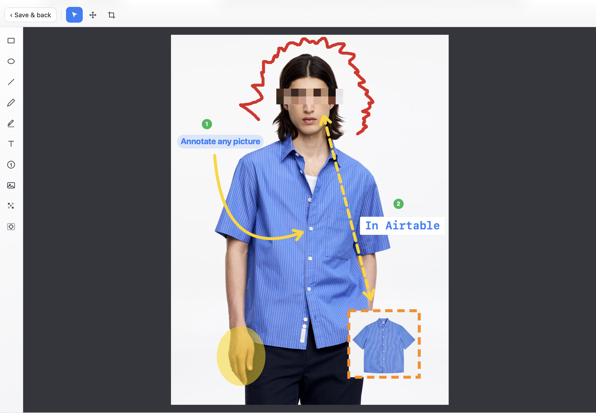
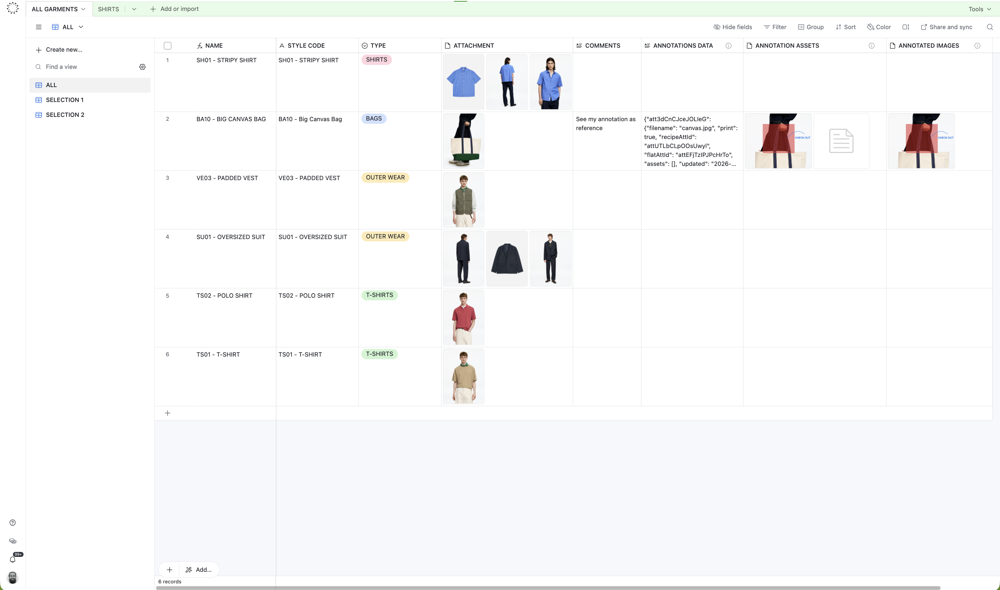
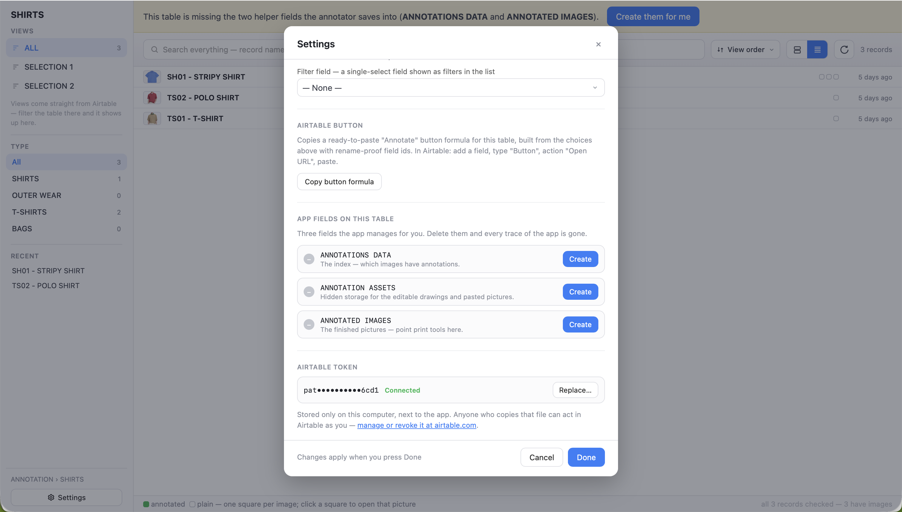
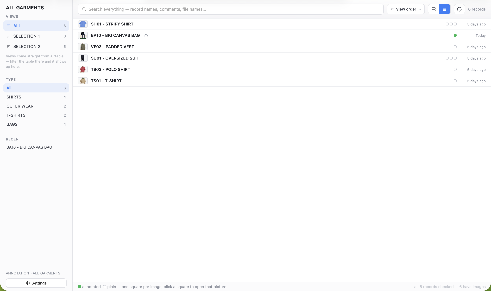
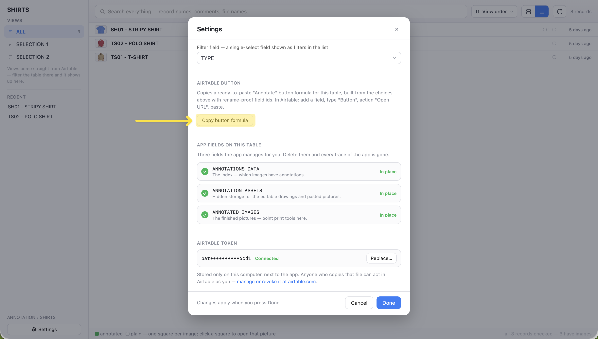
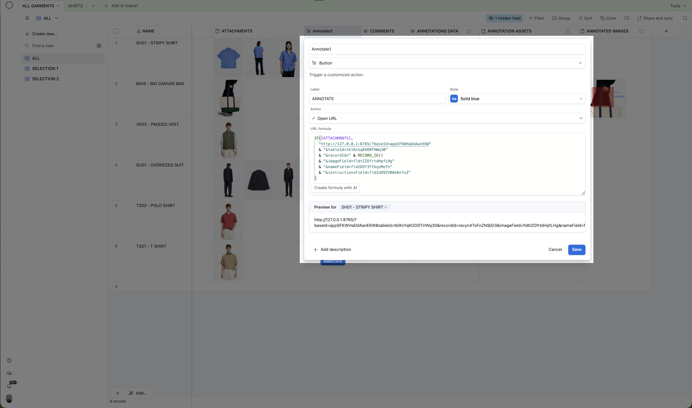
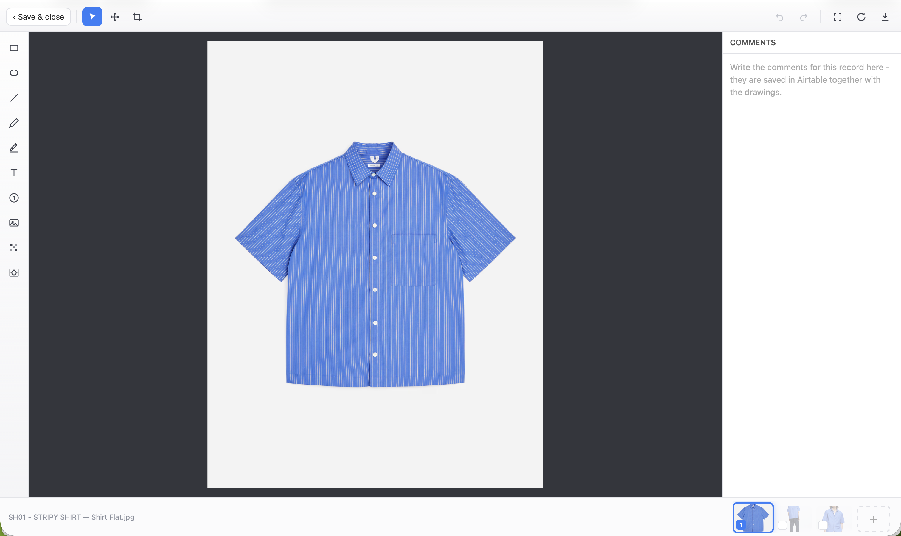

I’m working with various fashion companies to spec out and develop PLM systems. People in Fashion loves Excel, so one of the great things about Airtable is for onboarding you can make it feel a bit like Excel. 

Another thing people in fashion love is printing. Lots of printing. Especially product images with annotations that explain exactly how a garment should be made or changed and is a core part of the production process. Those printouts often end up on a sewing machine somewhere on the other side of the world, where the person making the garment doesn't have access to Airtable.

And this is where things become difficult. Airtable can feel like Excel, but it's not Excel. One area where it still falls short is image annotation. You can add simple annotations, but producing flattened, print-ready images isn't really possible. This however Excel is surprisingly good at. 

You can annotate an image, save it, and come back six months later to update it. It gets a bit clunky with larger files, but it get the job done none the less. And despite there is lots of things Excel is pretty shit at compared to Airtable, this image annotation capability has come back to bite us again and again.
  
So I thought I’d give it a stab at making something that can annotate images in Airtable, keep the annotations non-destructive, but also print the images as a flattened images. I've come up with this small app that runs locally. You only need Python, an internet connection and an Airtable token.

I've uploaded it to GitHub here - if it'll benefit others. You just download it and follow the readme. 

If you like it (or don't) I'm curious to hear what others think a
- what could make it better?
- if it's useful? 
- or not?

---

# Two ways to work
We tried to anticipate different ways of working. So there are two ways to use this app. You can work the way that best suits you and one way does not exclude the other.

**As a standalone app:** Opens the app in a browser window and you set it up to get the data from Airtable without going into Airtable. You pick the base, table and fields once, and it'll load your images and use Airtable as a database where everything lives

**From inside Airtable:** A button on the record opens the editor straight on that record's images and when done drops you back into Airtable.

It's using the same editor and the same stored data, so the two aren't mutually exclusive, the only thing to remember is they they both need the app running in the background to be able to work.


# How to run:

**Mac:** double-click  "Annotate Airtable Images.command"  
**Windows:** double-click  "Annotate Airtable Images (Windows).bat"

A terminal window opens (keep it open - that IS the app) and the editor appears in your web browser. If macOS complains the file is from an unidentified developer: right-click the .command file, choose "Open", then "Open" again. In my experience you should only need to do that once.

> **Note:** I don't have a windows machine so have actually not been testing the app on Windows! Please let me know if it works.


# Get a token with the right scopes. 
For the app to interact with Airtable you need to supply it with a token. 

1. Go to  https://airtable.com/create/tokens  and log in.
2. Either edit an existing token or add a new one.
3. Under "Scopes", make sure all four of these are added:  
        data.records:read  
        data.records:write  
        schema.bases:read  
        schema.bases:write
4. Under "Access", make sure the bases you want to annotate in are listed. If you want to be able to make annotations in all your bases set it to "All current and future bases"
5. Click Save changes. 
6. Save the token to paste in the apps settings section.


> Your token is stored only in "annotator_settings.json". Treat that file like a password - anyone who copies it can act in Airtable as you. If you ever share the app folder with anyone else, delete that one file first, and the app will ask them for their own token.


# Three supporting fields



Every table you annotate in needs these three fields. The easy way is to let the app add them: pick the table under “Settings” and click "Create the missing fields". If you'd rather add them by hand - or if your token does not have `schema.bases:write` you can. 

| #   | FIELD NAME            | FIELD TYPE | PURPOSE                                                                                                                                      |
| --- | --------------------- | ---------- | -------------------------------------------------------------------------------------------------------------------------------------------- |
| 1   | **ANNOTATIONS DATA**  | Long text  | A small text index that controls which images have annotations, and where their bits and pieces live. Don't edit by hand.                    |
| 2   | **ANNOTATION ASSETS** | Attachment | The hidden storage where the editable "drawing recipes" (small JSON files) and any pictures you use in your annotations. Don't edit by hand. |
| 3   | **ANNOTATED IMAGES**  | Attachment | The finished, flattened annotatated pictures.                                                                                                |



# Setup Standalone app



You run the app and the Standalone app will pop up in your browser. If you do not want to work in the app just close your browser window.

However first time use the main app to set all the preliminary settings. 

Go into settings, You fill it in once; after that, the app remembers and starts from there every time. Each table remembers its own view and fields, so switching between tables and back never lands you on the wrong ones.

Once it's set up, the overview is a list of your records:

- **Views rail on the left:** Your Airtable views show up here with a record count next to each, click one to switch, no trip to Settings. Filter the table in Airtable and it shows up here.
- **Search:** The box searches record names, comments AND file names, across the whole table - not just what's loaded on screen. Start typing and the app keeps loading the rest of the table in the background.
- **One square per image.** Each row shows a little square for every image on the record. Green means annotated, empty means plain. Click a square to open exactly that picture in the editor.
- **Recent.** The records you opened last sit at the top of the rail, one click away.
- **Comfortable / compact.** A view toggle top-right - compact fits about three times as many rows, handy on a 1,000-record table.

Records keep loading as you scroll, so big tables don't stall on opening. Click any row (or any square) to start annotating.


# Button mode from inside Airtable
You can put  button on your Airtable records that will open the annotator directly on that record’s images. There are a couple of ways to get the script for the button.

### Setup button using app settings



1) Click into settings
2) Setup the app for the base and table you want the button. Make sure all your important fields are setup.
3) Click "Copy Button Formula"
4) Past into your URL formula in your button field

### Setting it up by hand



```
IF({SHAREABLE IMAGES},
  "http://127.0.0.1:8765/?baseId=appXXXXXXXXXXXXXX"
  & "&tableId=tblXXXXXXXXXXXXXX"
  & "&recordId=" & RECORD_ID()
  & "&imageField=" & ENCODE_URL_COMPONENT("SHAREABLE IMAGES")
  & "&nameField=" & ENCODE_URL_COMPONENT("Sum")
  & "&instructionsField=" & ENCODE_URL_COMPONENT("COMMENT")
)
```

Swap in your own field names, and ID's.

A slightly better rename-proof way is setting it using field IDs. It's a bit more faff but it'll ensure the app works if someone changes field names: 

```
IF({SHAREABLE IMAGES},
  "http://127.0.0.1:8765/?baseId=appXXXXXXXXXXXXXX"
  & "&tableId=tblXXXXXXXXXXXXXX"
  & "&recordId=" & RECORD_ID()
  & "&imageField=fldXXXXXXXXXXXXXX"
  & "&nameField=fldXXXXXXXXXXXXXX"
  & "&instructionsField=fldXXXXXXXXXXXXXX"
)
```


>If you don't want to make comments while annotating and image remove "&instructionsField=fldXXXXXXXXXXXXXX" or "&instructionsField=" & ENCODE_URL_COMPONENT("COMMENT")

#### Where to find ID's
Base and table ids are sitting in your address bar when you open airtable in your browser.

```
https://airtable.com/appXXXXXXXXXXXXXX/tblXXXXXXXXXXXXXX/viwXXXXXXXXXXXXXX
		             └─ the BASE id ─┘ └ the TABLE id ─┘ └a view (ignore)┘

```

- The part starting with “app” is the base id.
- The part starting with “tbl” is the table id.

**Field ids** there are two ways I use:

1. **Manage fields.** With the table open, click *Manage fields* (top right, under Tools). The panel lists every field with a *Field ID* column. If you don't see that column, switch it on with the column-visibility toggle in the panel. Copy the ids from there.
2. **The base's API docs.** Airtable auto-generates a documentation page per base (your base → Help → API documentation) that lists every table's fields with their ids.


# Current capabilities




**TOOLBAR:** sits on the left side, each with a little icon. 

- **Box:** With or without fill and different opacities.
- **Circle:** With or without fill and different opacities.
- **Line/Arrow:** choose no head, one head or two in the top bar. Drag an arrow's round MIDDLE handle to bend it into a curve; double-click the middle to make it straight again.
- **Pen:** Free hand drawing
- **Highlight:** keeps its own colour and thickness - yellow as default with its own beefier thickness and always starts at 50% see-through.
- **Text:** There are different text styles so they can stand out on differnet images.
- **Numbered Marker:** Renumber themselves when one is deleted, so the sequence stays 1, 2, 3...; double-click a marker to give it a specific number. Their size comes ONLY from the badge-size menu in the top bar (five steps)
- **Image overlay:** you can also just drag and drop or copy and paste straight into the editor.
- **Blur:** is a live patch. It hides whatever sits under it - the photo and any annotation - and keeps doing so when you move or resize it. Five styles in the top bar menu, changeable any time while the patch i selected: three mosaic strengths (coarse / medium / fine pixel blocks) and two SOFT ones ("Soft blur" and  "Soft strong") that melt the area away smoothly instead of pixelating it.
- **Spotlight:** drag over the important part and everything outside it darkens for when you want to emphasise certain parts of an image.


**Other features:** 

**Writing comment while annotating:** Can switch on or off a long text field you can use to take notes while annotating.

**Cropping:** click the crop tool and everything outside the crop area darkens (the kept part stays exactly as it will look) - and a small pill above the corner shows the LIVE DIMENSIONS in real pixels while you drag. Pick a shape (Free, the photo's own shape, 1:1, 4:3 or 16:9), drag the bright area right, then press Apply (or Enter). Esc backs out unchanged; Delete removes the crop, so the whole picture is saved. Outside crop mode, the area is locked, so it can't be nudged by accident - and it is never actually cut from the original.

**Stacking:** with an annotation selected, "Front" and "Back" move it in front of or behind the other annotations so you can layer your more complicated annotations. The crop area always stays at the very bottom by itself.

**Colour menu:** has eight fixed colours plus "MY COLORS": press "+ Add to my colors…" under the swatches, pick anything in the system colour picker and confirm - the colour appears as a new swatch, already selected, and is remembered across sessions (the last eight picks, newest first).

**The filmstrip and rearrange imaged:** Down the bottom of the editor, the record's images sit as small thumbnails like a "filmstrip". The one you're editing is lifted and ringed in blue; click another start annotate another image. Your work on the current image is automatically first saved. Drag any thumbnail to reorder the images, the order is saved back to Airtable, and it's the order the printout follows. The "+" tile at the end adds a new photo to the record without leaving the app, and you can rename an image by clicking its filename at the bottom left.

Every thumbnail has a small square mark in its corner this is what decides what should exist as a flattened image and thus be printable:

- **Blue with a number** = this image is in the printout, at that position. Annotating an image marks it automatically.
- **Empty (image dimmed)** = not in the printout. Click the mark to include it, even without annotating it, a plain photo goes in as-is.

Click a blue mark to take an image back out of the flattened image field its annotations are kept, and it can come back with one click. 

**Edit image name:** You can edit attachment names in the editor and it syncs to Airtable. Having multiple images with same name shouldn't matter as images are loaded based on their ID.

**Auto save:** there is no separate save button; the "Save & back" button saves everything (if you changed anything) and then returns to the overview. Closing the browser tab with unsaved work makes the browser ask "Are you sure?" first. Cmd+S (Ctrl+S) saves in between, if you like pressing it.

**iPhone HEIC** photos are converted automatically on Macs, so they open in any browser. On Windows, that works too after a one-time helper install: open a terminal (Win+R, type cmd), run pip install pillow pillow-heif and restart the app.

**Sizes follow the photo** every size step - strokes, pen, highlight, text, markers, blur - automatically scales with the resolution of the picture, so "medium" looks medium on a phone snapshot AND on a 6000-pixel studio shot. You never think about DPI; just pick the step that looks right. 

**Two-finger scrolling:** on the trackpad moves around the picture; pinching (or holding Cmd/Ctrl while scrolling) zooms - just like in other design apps. "Fit" brings the whole picture back into view.

**Nudging:** the arrow keys move whatever is selected one pixel at a time; hold Shift for ten-pixel steps. 

**Duplicate:** Cmd+D (Ctrl+D) copies the selected drawing(s) with a slight offset. A duplicated numbered marker continues the sequence instead of repeating its number.  
**Resizing: Hold** SHIFT while dragging a corner handle to resize the shape proportionally. Without Shift, corners drag freely.

**Download annotated image:** The DOWNLOAD button (top right) saves the finished flattened picture - without touching Airtable. Handy for pasting into an email or chat.

**Delete/Undo/Redo:** The Delete key removes the selected annotation. Cmd+Z (Ctrl+Z) undoes; Cmd+Shift+Z (or Ctrl+Y) redoes what Undo took away.

**HOT KEYS:** Every tool has a hot key 

- R for Box, 
- O for Circle, 
- A for Arrow,
- P for Pen, 
- H for Highlight, 
- T for Text, 
- M for Marker, 
- B for Blur,
- I for Image, 
- C for Crop, 
- V for Select, 
- G for Pan. 